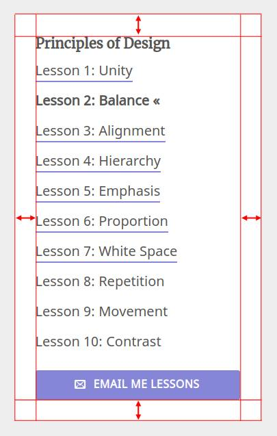
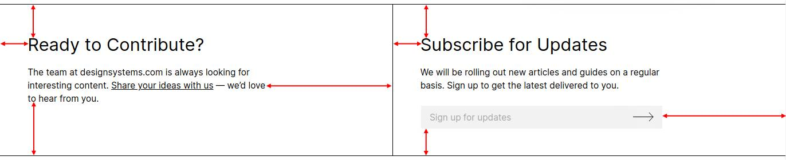

# Consistent Padding

## Description

The space between an element's perceived borders and its inner contents, commonly known as padding, should be consistent.

Consistency does not necessarily equate to perfect symmetry as long as a rhythm can be established.

## Valid Examples

### Symmetrical

* https://uxengineer.com/principles-of-design/white-space/

### Asymmetrical

* https://www.designsystems.com/space-grids-and-layouts/

## Invalid Examples

* https://www.airindia.in/

