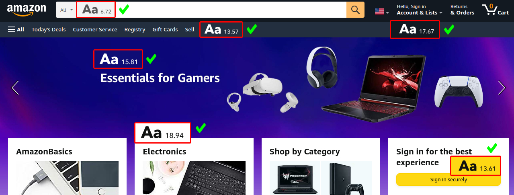
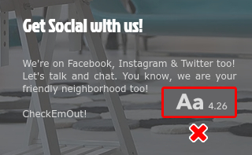

# Text Contrast

## Description

The color contrast ratio between the background and foreground text should be:

* 4.5:1 for body text
* 3:1 for large text, active user interface components, and graphical objects like icons and graphs

An enhanced contrast ratio ensure better accessibility:

* 7:1 for body text
* 4.5:1 for large text

More information:

* https://web.dev/color-and-contrast-accessibility/
* https://developer.mozilla.org/en-US/docs/Web/Accessibility/Understanding_WCAG/Perceivable/Color_contrast
* https://colourcontrast.cc/

## Element Detection

The design should be scanned for textual elements, ideally of any language.

If possible, the relative sizes of textual elements should be identified with respect to the overall design.

## Valid Examples

* https://web.archive.org/web/20210927123418/https://www.amazon.com/

## Invalid Examples

* https://web.archive.org/web/20210927233500/https://decalonz.wixsite.com/decalonzgraphicz

